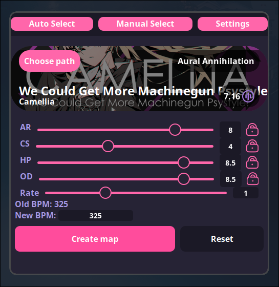

<h1 align="center">ruso</h1>
<p align="center"> </p>
<h2 align="center">A cross-platform CLI and GUI application to modify osu! beatmap parameters. (osu trainer clone)</h2>

## Preview
<p align="center"> </p>

## Features
- Change the approach rate, circle size, hp drain, overall difficulty, and playback rate of any osu! beatmap
    - Each field is populated upon loading a new map
        - Fields can be locked to prevent this behavior on a per-field basis
- Light, Dark, osu!, and custom color schemes
- Auto and manual map selection modes
    - Manually choose maps to modify using the file picker
    - Automatically choose maps to modify based on the currently chosen map inside of a running osu! instance (requires [gosumemory](https://github.com/l3lackShark/gosumemory) to be running)
- Tag generated maps with the "ruso-map" tag to easily find them inside osu!
- Calculate space used up by all generated maps
- Quickly remove all generated maps and audio files to free up unused space
- Generate .osz files for quickly loading maps into osu!
- Run [gosumemory](https://github.com/l3lackShark/gosumemory) on startup for seamless auto select integration

## Upcoming Features
- Customize the playback rate of a song while keeping its pitch intact
- No dependence on gosumemory for auto mode
- Fancy animations/Improved UI
- AR and OD scaling

## Getting Started
1. Install ruso using the [installation guide](#installation) for your OS.
2. Run ruso for the first time to initialize and create important files.
3. 
    - For GUI users: Enter the settings tab and set your osu! songs path as well as the path of your [gosumemory executable](#dependencies) if you plan to use auto mode.
    - For CLI users: Run `ruso --help` for help info to get started.


## Installation
**Windows and macOS:**
    Download the latest release from the [releases](https://github.com/Cyanistic/ruso/releases/latest) page.

**Debian and RHEL based Linux distributions:**
    Download and run the latest release's .deb and .rpm files respectively from the [releases](https://github.com/Cyanistic/ruso/releases/latest) page.

**Other Linux distributions:**
    Download the latest release's .appimage file from the [releases](https://github.com/Cyanistic/ruso/releases/latest) page.
If you prefer building from source, [follow these instructions](#building).

## Dependencies
- [gosumemory](https://github.com/l3lackShark/gosumemory) (optional) - Used to get map data from a running osu instance when using auto mode

All other dependencies are listed in the `Cargo.toml` file.

## Theming
Ruso offers the Light, Dark, and osu! themes out of the box. 

Basic custom theming is also supported by modifying the color variables in the automatically generated `custom.css` file. This file will be in your respective OS' configuration directory for ruso.

| Operating System | Path                                        | Example                                       |
|------------------|---------------------------------------------|-----------------------------------------------|
| Windows          | {FOLDERID_RoamingAppData}\ruso              | C:\Users\Alice\AppData\Roaming\ruso           |
| macOS            | $HOME/Library/Application Support/ruso      | /Users/Alice/Library/Application Support/ruso |
| Linux            | $XDG_CONFIG_HOME/ruso or $HOME/.config/ruso | /home/alice/.config/ruso                      |

## CLI Usage
Paths in this example are in Linux format but will be formatted for your respective OS when running `ruso --help`.
```
Generates osu! maps based on given args.
Running with no arguments runs the GUI version.
Usage: ruso [OPTIONS]

OPTIONS:
  -h, --help                      Print the help information and exit.
  -V, --version                   Print version and exit.
  -a, --approach-rate      [AR]   The approach rate of the map. Will remain unchanged if not provided.
  -b, --bpm                [BPM]  The new bpm of the map. This will override --rate if provided.
  -c, --circle-size        [CS]   The circle size of the map. Will remain unchanged if not provided.
  -d, --hp-drain           [HP]   The hp drain of the map. Will remain unchanged if not provided.
  -g, --gosumemory                Spawn gosumemory as a child process.
                                  This will use the paths provided in '$HOME/.config/ruso/settings.json' as the gosumemory and osu! songs path respectively.
  -o, --overall-difficulty [OD]   The overall difficulty of the map. Will remain unchanged if not provided.
  -p, --path               [PATH] The path to the osu! map.
                                  This can be a regular path or a path the osu! songs path provided in '$HOME/.config/ruso/settings.json' as the root.
                                  This is inferred, and the former will take precedence over the latter.
                                  If this is not provided, ruso will attempt to connect to a running gosumemory instance with the websocket url provided in '$HOME/.config/ruso/settings.json'.
  -r, --rate               [RATE] The playback rate (or speed) of the map.
                                  This will speed up the .osu file and the corresponding audio file.
  -/+z                            Enable (+z) or disable (-z) generation of .osz files.
                                  This will use value in '$HOME/.config/ruso/settings.json' if not provided.
```
## Building
Building ruso requires an up-to-date installation of [cargo](https://www.rust-lang.org/tools/install), the [Dioxus CLI](https://dioxuslabs.com/learn/0.4/CLI/installation) and the [dependencies listed by Dioxus](https://dioxuslabs.com/learn/0.4/getting_started/desktop#platform-specific-dependencies).

1. Clone the repo and cd into it.
```
git clone https://github.com/Cyanistic/ruso.git
cd ruso
```
2. Use the Dioxus CLI to bundle the application for your platform.
```
dx bundle --release
```
That's it! The bundled build artifacts of the application will be in `dist/bundle`. 

## Inspiration/Thanks
- The original [osu-trainer](https://github.com/FunOrange/osu-trainer) that inspired me to make a cross-platform version with more features
