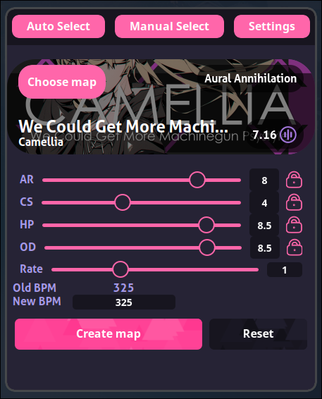

<div align="center">


**A cross-platform CLI and GUI application to easily modify osu! beatmap parameters. (osu trainer clone)**

[Features](#features) •
[Getting Started](#getting-started) •
[Installation](#installation) •
[Dependencies](#dependencies)

</div>

## Preview

<p align="center"> 
    
    <!-- <video alt-text="ruso-video" src="https://github.com/Cyanistic/ruso/assets/61608977/9d873855-38a4-4ca5-b186-fe66d65b2693"></video> -->
</p>


## Features

- Change the approach rate, circle size, hp drain, overall difficulty, and playback rate of any osu! beatmap
    - Each field is populated upon loading a new map
        - Fields can be locked to prevent this behavior on a per-field basis
- Support for mp3, ogg, and wav audio formats
- Light, Dark, osu!, and custom color schemes
- Auto and manual map selection modes
    - Manually choose maps to modify using the file picker
    - Automatically choose maps to modify based on the currently chosen map inside of a running osu! instance (requires [gosumemory] to be running)
- Tag generated maps with the "ruso-map" tag to easily find them inside osu!
- Calculate space used up by all generated maps
- Quickly remove all generated maps and audio files to free up unused space
- Generate .osz files for quickly loading maps into osu!
- Run [gosumemory] on startup for seamless auto select integration

## Upcoming Features

- Customize the playback rate of a song while keeping its pitch intact
- No dependence on gosumemory for auto mode
- Fancy animations/Improved UI
- AR and OD scaling

## Getting Started

1. Install ruso using the [installation guide](#installation) for your OS.
2. Run ruso for the first time to initialize and create important files.

<details> 
<summary>GUI users</summary>

>   Enter the settings tab and set your osu! songs path as well as the path of your [gosumemory executable](#dependencies) if you plan to use auto mode.

</details>

<details> 
<summary>CLI users</summary>

>   Run `ruso --help` for help info to get started.

</details> 

Note that mp3 files take approximately 1s to process for every 20s of audio. If ruso appears to be hanging while generating a map just give it a few seconds and it should finish up.

## Installation

<details>
   <summary>Windows</summary>

>   Download the latest release of `ruso-x86_64-pc-windows-msvc.exe` from the [releases] page.

</details>

<details>
   <summary>macOS</summary>

>   Download the latest release for your respective architecture from the [releases] page.
> 
> | Architecture    | File                        |
> | --------------- | --------------------------- |
> | Apple Silicon   | `ruso-aarch64-apple-darwin` |
> | Intel           | `ruso-x86_64-apple-darwin`  |

</details>

<details>
   <summary>Linux</summary>
    
>   Make sure you've installed the necessary [dependencies](#dependencies).
>
> | Distribution                    | Method                                                |
> |---------------------------------|-------------------------------------------------------|
> | Debian                          | `ruso_x.x.x_amd64.deb` from [releases]                |
> | Arch Linux (AUR)                | `yay -S ruso-bin` (not working yet)                   |
> | Any (Recommended if not listed) | `ruso-x86_64-unknown-linux-gnu` from [releases]       |
> | Any                             | `ruso_x.x.x_amd64.AppImage` from [releases] |

</details>

## Dependencies

<details>
    <summary>WebkitGTK (Linux only)</summary>

>   Required by GUI to draw the main window
>
> | Distribution | Method                                                                             |
> |--------------|------------------------------------------------------------------------------------|
> | Debian       | `sudo apt install libwebkit2gtk-4.1-dev libgtk-3-dev libayatana-appindicator3-dev` |
> | Arch Linux   | `sudo pacman -S webkit2gtk-4.1 gtk3 libappindicator-gtk3`                          |
> | Fedora/RHEL  | `sudo dnf install webkit2gtk4.1-devel libappindicator-gtk3-devel`                  |
> | openSUSE     | `sudo zypper install webkit2gtk3-soup2-devel libappindicator3-1`                   |
> | Gentoo       | `sudo emerge --ask net-libs/webkit-gtk:4.1 dev-libs/libappindicator`               |
> | Void         | `sudo xbps-install -S libwebkit2gtk41 gtk+3-devel libappindicator`                 |

</details>

- [gosumemory] (optional) - Used to get map data from a running osu instance when using auto mode

All other dependencies are listed in the `Cargo.toml` file.

## Theming

Ruso offers the Light, Dark, and osu! themes out of the box. 

Basic custom theming is also supported by modifying the color variables in the automatically generated `custom.css` file. This file will be in your respective OS' configuration directory for ruso.

| Operating System | Path                                        | Example                                       |
|------------------|---------------------------------------------|-----------------------------------------------|
| Windows          | {FOLDERID_RoamingAppData}\ruso              | C:\Users\Alice\AppData\Roaming\ruso           |
| macOS            | $HOME/Library/Application Support/ruso      | /Users/Alice/Library/Application Support/ruso |
| Linux            | $XDG_CONFIG_HOME/ruso or $HOME/.config/ruso | /home/alice/.config/ruso                      |

## CLI Usage

Paths in this example are in Linux format but will be formatted for your respective OS when running `ruso --help`.
```
Generates osu! maps based on given args.
Running with no arguments runs the GUI version.
Usage: ruso [OPTIONS]

OPTIONS:
  -h, --help                      Print the help information and exit.
  -V, --version                   Print version and exit.
  -a, --approach-rate      [AR]   The approach rate of the map. Will remain unchanged if not provided.
  -b, --bpm                [BPM]  The new bpm of the map. This will override --rate if provided.
  -c, --circle-size        [CS]   The circle size of the map. Will remain unchanged if not provided.
  -C, --clean                     Removes ALL maps generated by ruso.
  -d, --hp-drain           [HP]   The hp drain of the map. Will remain unchanged if not provided.
  -g, --gosumemory                Spawn gosumemory as a child process.
                                  This will use the paths provided in '$HOME/.config/ruso/settings.json' as the gosumemory and osu! songs path respectively.
  -o, --overall-difficulty [OD]   The overall difficulty of the map. Will remain unchanged if not provided.
  -p, --path               [PATH] The path to the osu! map.
                                  This can be a regular path or a path the osu! songs path provided in '$HOME/.config/ruso/settings.json' as the root.
                                  This is inferred, and the former will take precedence over the latter.
                                  If this is not provided, ruso will attempt to connect to a running gosumemory instance with the websocket url provided in '$HOME/.config/ruso/settings.json'.
  -r, --rate               [RATE] The playback rate (or speed) of the map.
                                  This will speed up the .osu file and the corresponding audio file.
  -u, --used-space              Print the amount of space used by maps generated by ruso in bytes.
  -/+z                            Enable (+z) or disable (-z) generation of .osz files.
                                  This will use the 'generate_osz' value in '$HOME/.config/ruso/settings.json' if not provided.
```
## Building

You can either build ruso into a standalone binary or bundle it into a self-contained package.

<details>
    <summary>Building (Recommended)</summary>

> Building ruso requires an up-to-date installation of [cargo].
> 
> 1. Clone the repo and cd into it.
> ```
> git clone https://github.com/Cyanistic/ruso.git
> cd ruso
> ```
> 2. Use cargo to build the application.
> ```
> cargo build --release
> ```
> That's it! The build artifacts will be in `target/release`. 

</details>

<details>
    <summary>Bundling</summary>

>Building ruso requires an up-to-date installation of [cargo], the [Dioxus CLI] and the [Dioxus dependencies].
>
>1. Clone the repo and cd into it.
>```
>git clone https://github.com/Cyanistic/ruso.git
>cd ruso
>```
>2. Use the Dioxus CLI to bundle the application for your platform.
>```
>dx bundle --release
>```
>That's it! The bundled build artifacts of the application will be in `dist/bundle`. 

</details>

## Suggestions/Criticisms

If you have any suggestions or criticisms you would like to share please post them in the [discussions](https://github.com/Cyanistic/ruso/discussions) page as they are greatly appreciated.

## Inspiration/Thanks

- The original [osu-trainer](https://github.com/FunOrange/osu-trainer) that inspired me to make a cross-platform version with more features
- [libosu](https://github.com/iptq/libosu) for making it easy to parse beatmaps (although I did have to add mania support myself)

[cargo]: https://www.rust-lang.org/tools/install
[Dioxus CLI]: https://dioxuslabs.com/learn/0.4/CLI/installation
[Dioxus dependencies]: https://dioxuslabs.com/learn/0.4/getting_started/desktop#platform-specific-dependencies
[gosumemory]: https://github.com/l3lackShark/gosumemory
[releases]: https://github.com/Cyanistic/ruso/releases/latest
